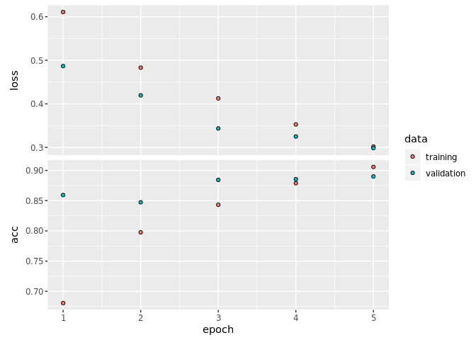
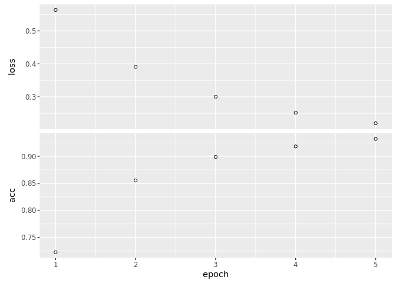

Assignment 1 DL umuoh
================

``` r
library(keras)
```

Loading The IMDB dataset
------------------------

``` r
imdb <- dataset_imdb(num_words = 10000)

c(c(train_data, train_labels), c(test_data, test_labels)) %<-% imdb
```

Preparing the data
------------------

You can't feed lists of integers into a neural network. You have to turn your lists into tensors.

We will One-hot-encode the lists to turn them into vectors of 0s and 1s. This would mean, for instance, turning the sequence `[3, 5]` into a 10,000-dimensional vector that would be all zeros except for indices 3 and 5, which would be ones. Then you could use as the first layer in your network a dense layer, capable of handling floating-point vector data.

Let's vectorize the data, which you'll do manually for maximum clarity.

``` r
vectorize_sequences <- function(sequences, dimension = 10000) {
  # Create an all-zero matrix of shape (len(sequences), dimension)
  results <- matrix(0, nrow = length(sequences), ncol = dimension)

  for (i in 1:length(sequences)) {
    # Sets specific indices of results[i] to 1s
    results[i, sequences[[i]]] <- 1
  }

  return(results)
}

# Our vectorized training data
x_train <- vectorize_sequences(train_data)

# Our vectorized test data
x_test <- vectorize_sequences(test_data)

# Our vectorized labels
y_train <- as.numeric(train_labels)
y_test <- as.numeric(test_labels)
```

Validating our approach
-----------------------

In order to monitor during training, the accuracy of the model on data that it has never seen before, we will create a "validation set" by setting apart 10,000 samples from the original training data:

``` r
val_indices <- 1:10000

x_val <- x_train[val_indices,]
partial_x_train <- x_train[-val_indices,]

y_val <- y_train[val_indices]
partial_y_train <- y_train[-val_indices]
```

Building our network
--------------------

``` r
model <- keras_model_sequential() %>%
  layer_dense(
    units = 16,
    activation = "relu",
    kernel_regularizer = regularizer_l2(0.0001),
    input_shape = c(10000)
    ) %>%
  layer_dropout(0.4) %>%
  layer_dense(
    units = 16,
    kernel_regularizer = regularizer_l2(0.0001),
    activation = "relu"
  ) %>%
  layer_dropout(0.4) %>%
  layer_dense(units = 1, activation = "sigmoid")
```

Here's the step where we configure our model with the `rmsprop` optimizer and the `binary_crossentropy` loss function. Note that we will also monitor accuracy during training.

``` r
model %>% compile(
  optimizer = "rmsprop",
  loss = "binary_crossentropy",
  metrics = c("accuracy")
)
```

We will now train our model for 5 epochs, in mini-batches of 512 samples. At this same time we will monitor loss and accuracy on the 10,000 samples that we set apart.

``` r
history_val <- model %>% fit(
  partial_x_train,
  partial_y_train,
  epochs = 5,
  batch_size = 512,
  validation_data = list(x_val, y_val)
)
```

Let's plot the visualize the training and validation metrics by epoch:

``` r
plot(history_val)
```



Results on the validation set
-----------------------------

``` r
results_val <- model %>% evaluate(x_val, y_val)

print(results_val)
```

    ## $loss
    ## [1] 0.2983979
    ##
    ## $acc
    ## [1] 0.89

Results on the test set
-----------------------

Let's train a new network from scratch for 5 epochs and then evaluate it on the test data.

``` r
new_model <- keras_model_sequential() %>%
  layer_dense(
    units = 16,
    activation = "relu",
    kernel_regularizer = regularizer_l2(0.0001),
    input_shape = c(10000)
    ) %>%
  layer_dropout(0.4) %>%
  layer_dense(
    units = 16,
    kernel_regularizer = regularizer_l2(0.0001),
    activation = "relu"
  ) %>%
  layer_dropout(0.4) %>%
  layer_dense(units = 1, activation = "sigmoid")

new_model %>% compile(
  optimizer = "rmsprop",
  loss = "binary_crossentropy",
  metrics = c("accuracy")
)
```

``` r
history_test <- new_model %>% fit(
  x_train,
  y_train,
  epochs = 5,
  batch_size = 512
)
```

Let's plot the visualize the training and test metrics by epoch:

``` r
plot(history_test)
```



``` r
results_test <- new_model %>% evaluate(x_test, y_test)

print(results_test)
```

    ## $loss
    ## [1] 0.3049535
    ##
    ## $acc
    ## [1] 0.88664

Conclusion
-----------

By applying L2 regularizers on both hidden layers and setting `l` to 0.0001 in addition to adding dropout layers and setting those to 0.3 (30%) I was able to improve the accuracy on the validation dataset to __89%__ which was a great improvement from the original __86%__. Although accuracy on validation set greatly improved, the accuracy on the test set only improved slightly from __87.8%__ to __88.6%__.