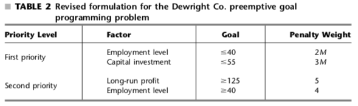

```{r}
library("lpSolveAPI")
```


Solve the following Goal Programming problem

For the Dewright Co. preemptive goal programming problem summarized in Table 2.



Note that

1. Different penalty weights are assigned within each of the two priority levels
2. The individual penalty weights (2 and 3) for the first-priority goals have been multiplied by M.

These penalty weights yield the following single linear programming model that incorporates all the goals.

Using the helper function ,`lp_do`, I can output the results from methods provided by `lpSolveAPI` in a nicer format.

```{r}
lp_do <- function(fn, value, dv_labels = c(""), constr_labels = c("")) {
    fn_name <- sprintf("%s", as.character(substitute(fn)))
    switch(fn_name,
           "solve" = {
               result <- fn(value)
               if (result == 0) {
                    return("Optimal solution found!")
                } else if (result == 2) {
                    return("The model is infeasible.")
                } else if (result == 3) {
                    return("The model is unbounded.")
                } else {
                    return(sprintf("Check documentation for status: %s", result))
                }
           },
           "get.objective" = {
                   sense <- substr(lp.control(value)$sense, 1, 3)
                   return(sprintf("Z %s = %g", sense, fn(value)))
           },
           "get.variables" = {
                   dv <- fn(value)
               
                   if (length(dv_labels) != length(dv)) {
                       return(dv)
                   }
                   else {
                       dv_df <-  data.frame(
                           DV = dv_labels,
                           Values = dv
                       )
                       
                       return(dv_df)
                   }
           },
           "get.constraints" = {
                   dv <- fn(value)
                   if (length(constr_labels) != length(dv)) {
                       return(dv)
                   }
                   else {
                       fmted_lables <- lapply(constr_labels, function (x) {return(sprintf("%s ->", x))})
                       dv_df <-  data.frame(
                           Constraints = unlist(fmted_lables),
                           Answers = dv
                       )
                       
                       return(dv_df)
                   }
           }
          )
}
```

```{r}
gp_prob <- read.lp("./data/GP_umuoh.lp")

gp_prob
```
M is set as 1000. The lp file that was read into `gp_prob` looks like:

```
/* Objective function */

/* M = 1000 */
min: 5 y1n + 2000 y2p + 4 y2n + 3000 y3p;

/* Constraints */
12 x1 + 9 x2 + 15 x3 - y1p + y1n = 125;
5 x1 + 3 x2 + 4 x3 - y2p + y2n = 40;
5 x1 + 7 x2 + 8 x3 - y3p +  y3n = 55;

x1 >= 0;
x2 >= 0;
x3 >= 0;

y1p >= 0;
y2p >= 0;
y3p >= 0;

y1n >= 0;
y2n >= 0;
y3n >= 0;
```

```{r}
lp_do(solve, gp_prob)
```

```{r}
lp_do(get.variables, gp_prob, dv_labels = c("y1n", "y2p", "y2n", "y3p", "x1" ,"x2", "x3", "y1p", "y3n"))
```

```{r}
lp_do(get.objective, gp_prob)
```

```{r}
lp_do(get.constraints, gp_prob, constr_labels = c(
  "12 x1 + 9 x2 + 15 x3 - y1p + y1n",
  "5 x1 + 3 x2 + 4 x3 - y2p + y2n",
  "5 x1 + 7 x2 + 8 x3 - y3p +  y3n"
  ))
```

