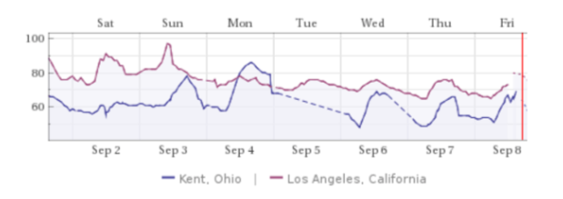

```{r}
# First load all our packages into r notebook
library("magrittr")
library("dplyr")
```

# Part A) Descriptive Statistics & Normal Distributions

>1.
    a. What is the probability of obtaining a score greater than 700 on
    a GMAT test that has a mean of 494 and a standard deviation of 100?
    Assume GMAT scores are normally distributed (5 marks).
    __Ans:__

```{r}
prob_greater_700 <- pnorm(700, mean = 494, sd = 100, lower.tail = F)

sprintf(
    "Probability of obtaining a score greater than 700 = %.2f%%",
    prob_greater_700 * 100
)
```

  >b. What is the probability of getting a score between 350 and 450 on the same
  GMAT exam?

  __Ans:__

We need to find the z score of score:

P(Score) => P(350 < Score < 450) = P(Score < 450) - P(Price < 350)

```{r}
prob_less_450 <- pnorm(450, mean = 494, sd = 100)
prob_less_350 <- pnorm(350, mean = 494, sd = 100)

prob_between_350_450 <- (prob_less_450 - prob_less_350)  * 100

sprintf(
    "Probability of obtaining a score between 350 and 450 = %.2f%%",
    prob_between_350_450
)
```

>2.
  Runzheimer International publishes business travel costs for various cities
  throughout the world. In particular, they publish per diem totals, which
  represent the average costs for the typical business traveler including three
  meals a day in business-class restaurants and single-rate lodging in
  business-class hotels and motels. If 86.65% of the per diem costs in Buenos
  Aires, Argentina, are less than $449 and if the standard deviation of per diem
  costs is $36, what is the average per diem cost in Buenos Aires? Assume that
  per diem costs are normally distributed.

  __Ans:__

```{r}
sd_per_diem <- 36
probabilty_per_diem <- 86.65/100

z_score_per_diem <- qnorm(probabilty_per_diem) %>% round(2)
print(sprintf("Z Score = %.2f", z_score_per_diem))

average_per_diem <- multiply_by(z_score_per_diem, sd_per_diem) %>%
  add(449) %>%
  round(digits = 2)

print(sprintf("Average per diem cost = %.2f ", average_per_diem))
```

>3.
  Chris is interested in understanding the correlation between temperature in
  Kent, OH and Los Angeles, CA. He has got the following data for September 2017
  from Alpha Knowledgebase.

  

  >He has sampled the mid-day temperature for days from Sep 2 to Sep 6 as
  follows:
   ```R
   Kent=c(59, 68, 78, 60)
   Los_Angeles=c(90, 82, 78, 75)
   ```
  >Calculate the correlation (Pearson Correlation Coefficient) between the
  temperatures of the two cities without using any R commands i.e. calculate
  step by step.

  __Ans:__

  Using the formula:
  

```{r}
kent <- c(59, 68, 78, 60)
los_angeles <- c(90, 82, 78, 75)

mean_kent <- mean(kent)
mean_la <- mean(los_angeles)

print(
  matrix(c(mean_kent, mean_la), ncol = 2) %>%
    set_colnames(c("Kent", "LA")) %>%
    set_rownames(c("Mean"))
)

kent_centered <- kent %>% subtract(mean_kent)
la_centered <- los_angeles %>% subtract(mean_la)

kent_sum_sqrt <- kent_centered %>% raise_to_power(2) %>% sum() %>% sqrt()
la_sum_sqrt <- la_centered %>% raise_to_power(2) %>% sum() %>% sqrt()

kent_la_ctr_sum <- multiply_by(kent_centered, la_centered) %>% sum()

pearson_coeff <- kent_la_ctr_sum / (kent_sum_sqrt * la_sum_sqrt)

sprintf("Pearson Correlation Coefficient = %f", pearson_coeff)
```

# Part B) Data Wrangling

>The ‘Online Retail’ dataset is a transnational data set which contains all the transactions occurring between 01 Dec 2010 and 09 Dec 2011 for a UK-based and registered non-store online retail. The company mainly sells unique all-occasion gifts. Many customers of the company are wholesalers.

```{r}
or_df <- read.csv("./data/online_retail.csv", colClasses=c(CustomerID="character"), na.strings=c("","NA"))

sprintf("Total number of transaction = %g", nrow(or_df))
```

Let's get a _feel_ for the data and call the `head` function on our dataframe

```{r}
head(or_df)
```


>4.
  Show the breakdown of the number of transactions by countries i.e. how many transactions are in
  the dataset for each country (consider all records including cancelled transactions). Show this
  in total number and also in percentage.

  __Ans:__

```{r}
calc_percentage <- function(n, total, digits = 3, fmt_nice = T ) {
  if (fmt_nice) {
    return(n %>%
             divide_by(total) %>%
             multiply_by(100) %>%
             sapply(function(x) {
               return(sprintf("%.2f%%", x))
               })
           )
  }
  return (n %>% divide_by(total) %>% multiply_by(100) %>% round(digits))
}

unique_trans_per_country <- or_df %>%
  select(Country, InvoiceNo) %>%
  distinct() %>%
  group_by(Country) %>%
  count(sort = T) %>%
  transform(percentage = calc_percentage(n, sum(n), fmt_nice = T)) %>%
  set_colnames(c("Country", "#No Transactions", "Percentage")) %>%
  head
```

  >Show only countries accounting for more than 1% of the total transactions.

```{r}
unique_trans_per_country %>% filter(Percentage > 1.00)
```

>5.
  Create a new variable ‘TransactionValue’ that is the product of the exising ‘Quantity’ and
  ‘UnitPrice’ variables. Add this variable to the dataframe.

  __Ans:__

```{r}
or_df_1 <- or_df %>% mutate(TransactionValue = Quantity * UnitPrice)

head(or_df_1)
```

>6.
  Using the newly created variable, TransactionValue, show the breakdown of transaction values by
  countries i.e. how much money in total has been spent each country. Show this in total sum of
  transaction values.

  __Ans:__

```{r}
country_transvals <- or_df_1 %>%
  group_by(Country) %>%
  summarise_at(
    vars(TransactionValue),
    funs(sum(., na.rm = T))
  )

head(country_transvals)
```

  >Show only countries with total transaction exceeding 130,000 British Pound.

```{r}
country_transvals %>% filter(TransactionValue > 130000)
```
>7.First let’s convert ‘InvoiceDate’ into a POSIXlt object:

```{r}
date_obj <- strptime(or_df_1$InvoiceDate,format='%m/%d/%Y %H:%M',tz='GMT')
or_df_1$Invoice_Date <-as.Date(date_obj)
or_df_1$Invoice_Day_Week= weekdays(or_df_1$Invoice_Date)
or_df_1$Invoice_Hour = as.numeric(format(date_obj, "%H"))
or_df_1$Invoice_Month = as.numeric(format(date_obj, "%m"))

or_df_1
```
  
  >a.Show the percentage of transactions (by numbers) by days of the week.
  
```{r}
or_df_1 %>%
  select(InvoiceNo, Invoice_Day_Week) %>%
  distinct() %>%
  group_by(Invoice_Day_Week) %>%
  count(sort = T) %>%
  transform(Percentage = calc_percentage(n, sum(n), fmt_nice = T))
```
  
  >b. Show the percentage of transactions (by transaction volume) by days of the week.
  
```{r}
or_df_1 %>%
  select(InvoiceNo, Invoice_Day_Week) %>%
  group_by(Invoice_Day_Week) %>%
  count(sort = T) %>%
  transform(Percentage = calc_percentage(n, sum(n), fmt_nice = T))
```

  >c. Show the percentage of transactions (by transaction volume) by month of the year.

```{r}
or_df_1 %>%
  select(InvoiceNo, Invoice_Month) %>%
  group_by(Invoice_Month) %>%
  count(sort = T) %>%
  transform(Percentage = calc_percentage(n, sum(n), fmt_nice = T))
```


>8.
  Plot the histogram of transaction values from Germany. Use the hist() function to plot.

  __Ans:__
```{r}
or_df_1 %>%
  filter(Country == 'Germany') %>%
  select(Country, TransactionValue) %>%
  use_series("TransactionValue") %>%
  hist(main = "Transaction Values of Germany", xlab = "TransactionValue")
```

>9.
  Which customer had the highest number of transactions? Which customer is most valuable (i.e. highest
  total sum of transactions)?

  __Ans:__

  >Below are the top 6 customers that have the highest number of transactions (sorted descendingly). It is
  interesting to note that __the customer with no customerID has the highest number of transactions__

```{r}
or_df_1 %>%
  select(CustomerID, Country, InvoiceNo) %>%
  distinct() %>%
  group_by(CustomerID) %>%
  count(sort = T) %>%
  head()
```

  >Below are the top 6 customers that have the highest total sum of transactions (sorted descendingly). It is interesting
  to note that __the customer with no customerID has the highest total sum of transactions__

```{r}
or_df_1 %>%
  select(CustomerID, Country, InvoiceNo, TransactionValue) %>%
  distinct() %>%
  group_by(CustomerID) %>%
  summarise_at(
    vars(TransactionValue),
    funs(sum(., na.rm = T))
  ) %>%
  arrange(desc(TransactionValue)) %>%
  head()
```

>10.
  Calculate the percentage of missing values for each variable in the dataset.

  __Ans:__

```{r}
or_df %>%
  is.na() %>%
  colMeans() %>%
  sapply(function(x) {
    return(sprintf("%.5f%%", x * 100))
  })
```

>11.
  What are the number of transactions with missing CustomerID records by countries?

  __Ans:__

```{r}
or_df_1 %>%
  select(CustomerID, Country, InvoiceNo) %>%
  distinct() %>%
  group_by(Country) %>%
  filter(is.na(CustomerID)) %>%
  count(sort = T)
```
>13.
  In the retail sector, it is very important to understand the return rate of the goods purchased by customers. In this
  example, we can define this quantity, simply, as the ratio of the number of transactions cancelled (regardless of the
  transaction value) over the total number of transactions. With this definition, what is the return rate for the French
  customers? Consider the cancelled transactions as those where the ‘Quantity’ variable has a negative value.

  __Ans:__

  >As you can see below there are __69__ cancelled transactions owned by customers in France and then the return rate is `0.1496746`

```{r}
# Get the Total number of unquie transaction rows for France
france_total_trans <- or_df_1 %>%
  filter(Country == "France") %>%
  select(Country, InvoiceNo) %>%
  distinct() %>%
  count() %>%
  use_series("n")

# Calculate the Return Rate for customer in France
or_df_1 %>%
  filter(Quantity < 1) %>%
  filter(Country == "France") %>%
  select(Country, InvoiceNo) %>%
  distinct() %>%
  count() %>%
  mutate(ReturnRate = n/france_total_trans)
```

>14.
  What is the product that has generated the highest revenue for the retailer? (i.e. item with the highest total sum of
  ‘TransactionValue’).

  __Ans:__

  > The product with StockCode __DOT__ generates the highest revenue for the retailer.

```{r}
or_df_1 %>%
  group_by(StockCode) %>%
  summarise_at(
    vars(TransactionValue),
    funs(sum(., na.rm = T))
  ) %>%
  arrange(desc(TransactionValue)) %>%
  head()
```

>15.
  How many unique customers are represented in the dataset? You can use unique() and length() functions.

  __Ans:__

```{r}
or_df_1 %>%
  select(CustomerID) %>%
  distinct() %>%
  count() %>%
  use_series("n") %>%
  sprintf("There are %d unique customers represented in the dataset.", .)
```

