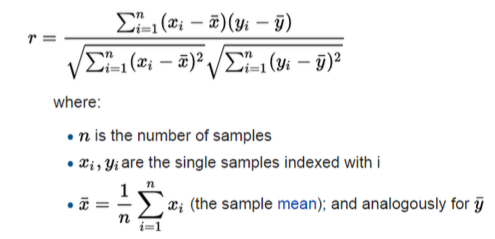
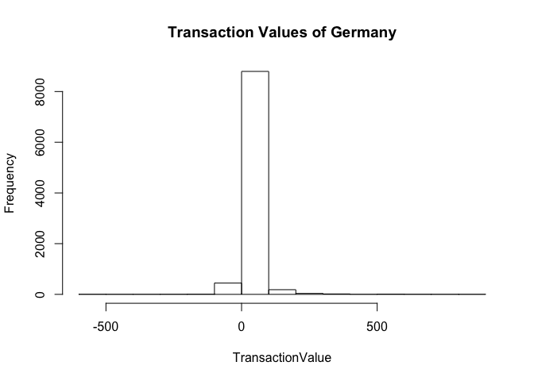

Assignment 1
================

``` r
# First load all our packages into r notebook
library("magrittr")
library("dplyr")
```

# Part A Descriptive Statistics & Normal Distributions

## 1\.

### a. What is the probability of obtaining a score greater than 700 on a GMAT test that has a mean of 494 and a standard deviation of 100? Assume GMAT scores are normally distributed (5 marks).

**Ans:**

``` r
prob_greater_700 <- pnorm(700, mean = 494, sd = 100, lower.tail = F)

sprintf(
    "Probability of obtaining a score greater than 700 = %.2f%%",
    prob_greater_700 * 100
)
```

    ## [1] "Probability of obtaining a score greater than 700 = 1.97%"

### b. What is the probability of getting a score between 350 and 450 on the same GMAT exam?

**Ans:**

We need to find the z score of score:

P(Score) =\> P(350 \< Score \< 450) = P(Score \< 450) - P(Price \< 350)

``` r
prob_less_450 <- pnorm(450, mean = 494, sd = 100)
prob_less_350 <- pnorm(350, mean = 494, sd = 100)

prob_between_350_450 <- (prob_less_450 - prob_less_350)  * 100

sprintf(
    "Probability of obtaining a score between 350 and 450 = %.2f%%",
    prob_between_350_450
)
```

    ## [1] "Probability of obtaining a score between 350 and 450 = 25.50%"

## 2\. Runzheimer International publishes business travel costs for various cities throughout the world. In particular, they publish per diem totals, which represent the average costs for the typical business traveler including three meals a day in business-class restaurants and single-rate lodging in business-class hotels and motels. If 86.65% of the per diem costs in Buenos Aires, Argentina, are less than $449 and if the standard deviation of per diem costs is $36, what is the average per diem cost in Buenos Aires? Assume that per diem costs are normally distributed.

**Ans:**

``` r
sd_per_diem <- 36
probabilty_per_diem <- 86.65/100

z_score_per_diem <- qnorm(probabilty_per_diem) %>% round(2)
print(sprintf("Z Score = %.2f", z_score_per_diem))
```

    ## [1] "Z Score = 1.11"

``` r
average_per_diem <- multiply_by(z_score_per_diem, sd_per_diem) %>%
  multiply_by(-1) %>%
  add(449) %>%
  round(digits = 2)

print(sprintf("Average per diem cost = %.2f ", average_per_diem))
```

    ## [1] "Average per diem cost = 409.04 "

## 3\. Chris is interested in understanding the correlation between temperature in Kent, OH and Los Angeles, CA. He has got the following data for September 2017 from Alpha Knowledgebase.


He has sampled the mid-day temperature for days from Sep 2 to Sep 6 as
follows:

``` r
Kent=c(59, 68, 78, 60)
Los_Angeles=c(90, 82, 78, 75)
```

Calculate the correlation (Pearson Correlation Coefficient) between the
temperatures of the two cities without using any R commands
i.e. calculate step by step.

**Ans:**

Using the formula:



``` r
kent <- c(59, 68, 78, 60)
los_angeles <- c(90, 82, 78, 75)

mean_kent <- mean(kent)
mean_la <- mean(los_angeles)

print(
  matrix(c(mean_kent, mean_la), ncol = 2) %>%
    set_colnames(c("Kent", "LA")) %>%
    set_rownames(c("Mean"))
)
```

    ##       Kent    LA
    ## Mean 66.25 81.25

``` r
kent_centered <- kent %>% subtract(mean_kent)
la_centered <- los_angeles %>% subtract(mean_la)

kent_sum_sqrt <- kent_centered %>% raise_to_power(2) %>% sum() %>% sqrt()
la_sum_sqrt <- la_centered %>% raise_to_power(2) %>% sum() %>% sqrt()

kent_la_ctr_sum <- multiply_by(kent_centered, la_centered) %>% sum()

pearson_coeff <- kent_la_ctr_sum / (kent_sum_sqrt * la_sum_sqrt)

sprintf("Pearson Correlation Coefficient = %f", pearson_coeff)
```

    ## [1] "Pearson Correlation Coefficient = -0.356605"

# Part B Data Wrangling

The ‘Online Retail’ dataset is a transnational data set which contains
all the transactions occurring between 01 Dec 2010 and 09 Dec 2011 for a
UK-based and registered non-store online retail. The company mainly
sells unique all-occasion gifts. Many customers of the company are
wholesalers.

``` r
or_df <- read.csv("./data/online_retail.csv", colClasses=c(CustomerID="character"), na.strings=c("","NA"))

sprintf("Total number of transaction = %g", nrow(or_df))
```

    ## [1] "Total number of transaction = 541909"

Let’s get a *feel* for the data and call the `head` function on our
dataframe

``` r
head(or_df)
```

    ##   InvoiceNo StockCode                         Description Quantity
    ## 1    536365    85123A  WHITE HANGING HEART T-LIGHT HOLDER        6
    ## 2    536365     71053                 WHITE METAL LANTERN        6
    ## 3    536365    84406B      CREAM CUPID HEARTS COAT HANGER        8
    ## 4    536365    84029G KNITTED UNION FLAG HOT WATER BOTTLE        6
    ## 5    536365    84029E      RED WOOLLY HOTTIE WHITE HEART.        6
    ## 6    536365     22752        SET 7 BABUSHKA NESTING BOXES        2
    ##      InvoiceDate UnitPrice CustomerID        Country
    ## 1 12/1/2010 8:26      2.55      17850 United Kingdom
    ## 2 12/1/2010 8:26      3.39      17850 United Kingdom
    ## 3 12/1/2010 8:26      2.75      17850 United Kingdom
    ## 4 12/1/2010 8:26      3.39      17850 United Kingdom
    ## 5 12/1/2010 8:26      3.39      17850 United Kingdom
    ## 6 12/1/2010 8:26      7.65      17850 United Kingdom

## 4\. Show the breakdown of the number of transactions by countries i.e. how many transactions are in the dataset for each country (consider all records including cancelled transactions). Show this in total number and also in percentage.

**Ans:**

``` r
calc_percentage <- function(n, total, digits = 3, fmt_nice = T ) {
  if (fmt_nice) {
    return(n %>%
             divide_by(total) %>%
             multiply_by(100) %>%
             sapply(function(x) {
               return(sprintf("%.2f%%", x))
               })
           )
  }
  return (n %>% divide_by(total) %>% multiply_by(100) %>% round(digits))
}

unique_trans_per_country <- or_df %>%
  select(Country, InvoiceNo) %>%
  distinct() %>%
  group_by(Country) %>%
  count(sort = T) %>%
  transform(percentage = calc_percentage(n, sum(n), fmt_nice = F)) %>%
  set_colnames(c("Country", "#No Transactions", "Percentage")) %>%
  head()
```

Show only countries accounting for more than 1% of the total
transactions.

``` r
unique_trans_per_country %>% filter(Percentage > 1.00)
```

    ##          Country #No Transactions Percentage
    ## 1 United Kingdom            23494     90.710
    ## 2        Germany              603      2.328
    ## 3         France              461      1.780
    ## 4           EIRE              360      1.390

## 5\. Create a new variable `TransactionValue` that is the product of the exising `Quantity` and `UnitPrice` variables. Add this variable to the dataframe.

**Ans:**

``` r
or_df_1 <- or_df %>% mutate(TransactionValue = Quantity * UnitPrice)

head(or_df_1)
```

    ##   InvoiceNo StockCode                         Description Quantity
    ## 1    536365    85123A  WHITE HANGING HEART T-LIGHT HOLDER        6
    ## 2    536365     71053                 WHITE METAL LANTERN        6
    ## 3    536365    84406B      CREAM CUPID HEARTS COAT HANGER        8
    ## 4    536365    84029G KNITTED UNION FLAG HOT WATER BOTTLE        6
    ## 5    536365    84029E      RED WOOLLY HOTTIE WHITE HEART.        6
    ## 6    536365     22752        SET 7 BABUSHKA NESTING BOXES        2
    ##      InvoiceDate UnitPrice CustomerID        Country TransactionValue
    ## 1 12/1/2010 8:26      2.55      17850 United Kingdom            15.30
    ## 2 12/1/2010 8:26      3.39      17850 United Kingdom            20.34
    ## 3 12/1/2010 8:26      2.75      17850 United Kingdom            22.00
    ## 4 12/1/2010 8:26      3.39      17850 United Kingdom            20.34
    ## 5 12/1/2010 8:26      3.39      17850 United Kingdom            20.34
    ## 6 12/1/2010 8:26      7.65      17850 United Kingdom            15.30

## 6\. Using the newly created variable, TransactionValue, show the breakdown of transaction values by countries i.e. how much money in total has been spent each country. Show this in total sum of transaction values.

**Ans:**

``` r
country_transvals <- or_df_1 %>%
  group_by(Country) %>%
  summarise_at(
    vars(TransactionValue),
    funs(sum(., na.rm = T))
  )
```

    ## Warning: funs() is soft deprecated as of dplyr 0.8.0
    ## please use list() instead
    ## 
    ## # Before:
    ## funs(name = f(.)
    ## 
    ## # After: 
    ## list(name = ~f(.))
    ## This warning is displayed once per session.

``` r
head(country_transvals)
```

    ## # A tibble: 6 x 2
    ##   Country   TransactionValue
    ##   <fct>                <dbl>
    ## 1 Australia          137077.
    ## 2 Austria             10154.
    ## 3 Bahrain               548.
    ## 4 Belgium             40911.
    ## 5 Brazil               1144.
    ## 6 Canada               3666.

Show only countries with total transaction exceeding 130,000 British
Pound.

``` r
country_transvals %>% filter(TransactionValue > 130000)
```

    ## # A tibble: 6 x 2
    ##   Country        TransactionValue
    ##   <fct>                     <dbl>
    ## 1 Australia               137077.
    ## 2 EIRE                    263277.
    ## 3 France                  197404.
    ## 4 Germany                 221698.
    ## 5 Netherlands             284662.
    ## 6 United Kingdom         8187806.

## 7\. First let’s convert `InvoiceDate` into a POSIXlt object:

``` r
date_obj <- strptime(or_df_1$InvoiceDate,format='%m/%d/%Y %H:%M',tz='GMT')
or_df_1$Invoice_Date <-as.Date(date_obj)
or_df_1$Invoice_Day_Week= weekdays(or_df_1$Invoice_Date)
or_df_1$Invoice_Hour = as.numeric(format(date_obj, "%H"))
or_df_1$Invoice_Month = as.numeric(format(date_obj, "%m"))

head(or_df_1)
```

    ##   InvoiceNo StockCode                         Description Quantity
    ## 1    536365    85123A  WHITE HANGING HEART T-LIGHT HOLDER        6
    ## 2    536365     71053                 WHITE METAL LANTERN        6
    ## 3    536365    84406B      CREAM CUPID HEARTS COAT HANGER        8
    ## 4    536365    84029G KNITTED UNION FLAG HOT WATER BOTTLE        6
    ## 5    536365    84029E      RED WOOLLY HOTTIE WHITE HEART.        6
    ## 6    536365     22752        SET 7 BABUSHKA NESTING BOXES        2
    ##      InvoiceDate UnitPrice CustomerID        Country TransactionValue
    ## 1 12/1/2010 8:26      2.55      17850 United Kingdom            15.30
    ## 2 12/1/2010 8:26      3.39      17850 United Kingdom            20.34
    ## 3 12/1/2010 8:26      2.75      17850 United Kingdom            22.00
    ## 4 12/1/2010 8:26      3.39      17850 United Kingdom            20.34
    ## 5 12/1/2010 8:26      3.39      17850 United Kingdom            20.34
    ## 6 12/1/2010 8:26      7.65      17850 United Kingdom            15.30
    ##   Invoice_Date Invoice_Day_Week Invoice_Hour Invoice_Month
    ## 1   2010-12-01        Wednesday            8            12
    ## 2   2010-12-01        Wednesday            8            12
    ## 3   2010-12-01        Wednesday            8            12
    ## 4   2010-12-01        Wednesday            8            12
    ## 5   2010-12-01        Wednesday            8            12
    ## 6   2010-12-01        Wednesday            8            12

### a. Show the percentage of transactions (by numbers) by days of the week.

**Ans:**

``` r
or_df_1 %>%
  select(InvoiceNo, Invoice_Day_Week) %>%
  distinct() %>%
  group_by(Invoice_Day_Week) %>%
  count(sort = T) %>%
  transform(Percentage = calc_percentage(n, sum(n), fmt_nice = T))
```

    ##   Invoice_Day_Week    n Percentage
    ## 1         Thursday 5660     21.85%
    ## 2        Wednesday 4815     18.59%
    ## 3          Tuesday 4722     18.23%
    ## 4           Friday 4184     16.15%
    ## 5           Monday 4138     15.98%
    ## 6           Sunday 2381      9.19%

### b. Show the percentage of transactions (by transaction volume) by days of the week.

**Ans:**

``` r
or_df_1 %>%
  select(TransactionValue, Invoice_Day_Week) %>%
  group_by(Invoice_Day_Week) %>%
  summarise(TransactionValueSum = sum(TransactionValue)) %>%
  transform(Percentage = calc_percentage(TransactionValueSum, sum(TransactionValueSum), fmt_nice = T))
```

    ##   Invoice_Day_Week TransactionValueSum Percentage
    ## 1           Friday           1540610.8     15.80%
    ## 2           Monday           1588609.4     16.30%
    ## 3           Sunday            805678.9      8.27%
    ## 4         Thursday           2112519.0     21.67%
    ## 5          Tuesday           1966182.8     20.17%
    ## 6        Wednesday           1734147.0     17.79%

### c. Show the percentage of transactions (by transaction volume) by month of the year.

**Ans:**

``` r
or_df_1 %>%
  select(TransactionValue, Invoice_Month) %>%
  group_by(Invoice_Month) %>%
  summarise(TransactionValueSum = sum(TransactionValue)) %>%
  transform(Percentage = calc_percentage(TransactionValueSum, sum(TransactionValueSum), fmt_nice = T)) %>%
  head()
```

    ##   Invoice_Month TransactionValueSum Percentage
    ## 1             1            560000.3      5.74%
    ## 2             2            498062.6      5.11%
    ## 3             3            683267.1      7.01%
    ## 4             4            493207.1      5.06%
    ## 5             5            723333.5      7.42%
    ## 6             6            691123.1      7.09%

### d. What was the date with the highest number of transactions from Australia?

**Ans:**

As can be seen below, the dates with the highest number of transactions
in Australia is **2011-02-07** and **2011-09-28**.

``` r
or_df_1 %>%
  select(Country, Invoice_Date, InvoiceNo) %>%
  filter(Country == "Australia") %>%
  distinct() %>%
  group_by(Invoice_Date) %>%
  count(sort = T) %>%
  subset(n == max(n))
```

    ## # A tibble: 2 x 2
    ## # Groups:   Invoice_Date [2]
    ##   Invoice_Date     n
    ##   <date>       <int>
    ## 1 2011-02-07       4
    ## 2 2011-09-28       4

### e. The company needs to shut down the website for two consecutive hours for maintenance. What would be the hour of the day to start this so that the distribution is at minimum for the customers? The responsible IT team is available from 7:00 to 20:00 every day

**Ans:**

In order to solve the problem we need to select the columns that are
relevant to us and then sum the total number of transaction (including
cancelled transactions) per invoice hour but only focusing on hours
between 7:00 and 20:00.

``` r
no_trans_per_hour <- or_df_1 %>%
  select(CustomerID, Invoice_Hour, InvoiceNo) %>%
  distinct() %>%
  group_by(Invoice_Hour) %>%
  count(sort = F) %>%
  summarise(total_trans = sum(n)) %>%
  filter(Invoice_Hour >= 7 & Invoice_Hour <= 20)

no_trans_per_hour
```

    ## # A tibble: 14 x 2
    ##    Invoice_Hour total_trans
    ##           <dbl>       <int>
    ##  1            7          31
    ##  2            8         624
    ##  3            9        1824
    ##  4           10        2961
    ##  5           11        3165
    ##  6           12        3962
    ##  7           13        3369
    ##  8           14        3137
    ##  9           15        3069
    ## 10           16        1952
    ## 11           17        1205
    ## 12           18         333
    ## 13           19         219
    ## 14           20          28

Below we define helper functions to assist in solving the
problem

``` r
# Given the hours as a vector you get a vector of total transactions belonging
# to each hour
get.total_trans <- function(target_hrs, trans_per_hrs) {
  return(trans_per_hrs %>%
           subset(Invoice_Hour %in% target_hrs) %>%
           use_series("total_trans")
         )
}

# Given a dataframe with permuations of hours, it will only return the columns in which
# the hour combination are consecutive meaning hour 1 -> 2 -> 3
only_consecutive_hrs <- function (hrs) {
  return(
    hrs %>%
      apply(MARGIN = 2, FUN = function(v) {
        diff_hrs <- sum(diff(v))

        if (diff_hrs == 2) {
          return(v)
        }

        return(NA)
      })
  )
}
```

Generate all possible 2 hour permutations but then only select those
that are consecutive

``` r
hr_permuations <- combn(no_trans_per_hour$Invoice_Hour, 3) %>%
  as.data.frame() %>%
  only_consecutive_hrs() %>%
  as.data.frame() %>%
  select_if(~ !any(is.na(.)))

hr_permuations
```

    ##   V1 V79 V145 V200 V245 V281 V309 V330 V345 V355 V361 V364
    ## 1  7   8    9   10   11   12   13   14   15   16   17   18
    ## 2  8   9   10   11   12   13   14   15   16   17   18   19
    ## 3  9  10   11   12   13   14   15   16   17   18   19   20

Now that we have all the possible 2 consecutive hour permutations, we
add up all the total no transactions for each hour in order to get the
total number of transactions for each 2 consecutive hour we have
generated.

``` r
all_2hr_permuations <- hr_permuations %>%
  apply(MARGIN = 2, FUN = function(v) {
    return(get.total_trans(v, no_trans_per_hour) %>%
      sum() %>%
      c(v, .)
    )
  }) %>%
  t() %>%
  as.data.frame()

colnames(all_2hr_permuations) <- c("Hour 1", "Hour 2", "Hour 3", "Total_Sum_Transactions")

all_2hr_permuations
```

    ##      Hour 1 Hour 2 Hour 3 Total_Sum_Transactions
    ## V1        7      8      9                   2479
    ## V79       8      9     10                   5409
    ## V145      9     10     11                   7950
    ## V200     10     11     12                  10088
    ## V245     11     12     13                  10496
    ## V281     12     13     14                  10468
    ## V309     13     14     15                   9575
    ## V330     14     15     16                   8158
    ## V345     15     16     17                   6226
    ## V355     16     17     18                   3490
    ## V361     17     18     19                   1757
    ## V364     18     19     20                    580

Finally we can figure out the 2 hours that company can use for
maintainance without affecting the customers too badly. As you can see
below, the hours between 18 and 20 (6pm and 8pm) are the best for the
company’s 2 hour
maintainance.

``` r
all_2hr_permuations[which.min(all_2hr_permuations$Total_Sum_Transactions),]
```

    ##      Hour 1 Hour 2 Hour 3 Total_Sum_Transactions
    ## V364     18     19     20                    580

## 8\. Plot the histogram of transaction values from Germany. Use the `hist()` function to plot.

**Ans:**

``` r
or_df_1 %>%
  filter(Country == 'Germany') %>%
  select(Country, TransactionValue) %>%
  use_series("TransactionValue") %>%
  hist(main = "Transaction Values of Germany", xlab = "TransactionValue")
```

<!-- -->

## 9\. Which customer had the highest number of transactions? Which customer is most valuable (i.e. highest total sum of transactions)?

**Ans:**

Below are the top 6 customers that have the highest number of
transactions (sorted descendingly). It is interesting to note that **the
customer with customerID 14911 has the highest number of transactions**.
We filter out the cusomters with CutomerIDs equal to `NA`. We exclude
them because there are not identifiable.

``` r
or_df_1 %>%
  select(CustomerID, Country, InvoiceNo) %>%
  filter(!is.na(CustomerID)) %>%
  distinct() %>%
  group_by(CustomerID) %>%
  count(sort = T) %>%
  head()
```

    ## # A tibble: 6 x 2
    ## # Groups:   CustomerID [6]
    ##   CustomerID     n
    ##   <chr>      <int>
    ## 1 14911        248
    ## 2 12748        224
    ## 3 17841        169
    ## 4 14606        128
    ## 5 13089        118
    ## 6 15311        118

Below are the top 6 customers that have the highest total sum of
transactions (sorted descendingly). It is interesting to note that **the
customer with customerID 14646 has the highest total sum of
transactions**. We filter out the cusomters with CutomerIDs equal to
`NA`. We exclude them because there are not identifiable.

``` r
or_df_1 %>%
  select(CustomerID, Country, InvoiceNo, TransactionValue) %>%
  filter(!is.na(CustomerID)) %>%
  distinct() %>%
  group_by(CustomerID) %>%
  summarise_at(
    vars(TransactionValue),
    funs(sum(., na.rm = T))
  ) %>%
  arrange(desc(TransactionValue)) %>%
  head()
```

    ## # A tibble: 6 x 2
    ##   CustomerID TransactionValue
    ##   <chr>                 <dbl>
    ## 1 14646               197186.
    ## 2 18102               170150.
    ## 3 17450               161195.
    ## 4 14911                90800.
    ## 5 14156                87038.
    ## 6 12415                84701.

## 10\. Calculate the percentage of missing values for each variable in the dataset.

**Ans:**

``` r
or_df %>%
  is.na() %>%
  colMeans() %>%
  sapply(function(x) {
    return(sprintf("%.5f%%", x * 100))
  })
```

    ##   InvoiceNo   StockCode Description    Quantity InvoiceDate   UnitPrice 
    ##  "0.00000%"  "0.00000%"  "0.26831%"  "0.00000%"  "0.00000%"  "0.00000%" 
    ##  CustomerID     Country 
    ## "24.92669%"  "0.00000%"

## 11\. What are the number of transactions with missing CustomerID records by countries?

**Ans:**

``` r
or_df_1 %>%
  select(CustomerID, Country, InvoiceNo) %>%
  distinct() %>%
  group_by(Country) %>%
  filter(is.na(CustomerID)) %>%
  count(sort = T)
```

    ## # A tibble: 9 x 2
    ## # Groups:   Country [9]
    ##   Country            n
    ##   <fct>          <int>
    ## 1 United Kingdom  3637
    ## 2 EIRE              41
    ## 3 Hong Kong         15
    ## 4 Unspecified        5
    ## 5 France             3
    ## 6 Israel             3
    ## 7 Switzerland        3
    ## 8 Bahrain            2
    ## 9 Portugal           1

## 12\. On average, how often do the costumers comeback to the website for their next shopping? (i.e. what is the average number of days between consecutive shopping).

**Ans:**

``` r
customer_days <- or_df_1 %>%
  select(CustomerID, Invoice_Date) %>%
  distinct() %>%
  arrange(Invoice_Date) %>%
  group_by(CustomerID) %>%
  mutate(no_days = sum(diff(Invoice_Date))) %>%
  arrange(no_days)  %>%
  filter(no_days > 0)

customer_days
```

    ## # A tibble: 18,192 x 3
    ## # Groups:   CustomerID [2,992]
    ##    CustomerID Invoice_Date no_days
    ##    <chr>      <date>       <time> 
    ##  1 15922      2010-12-01   1 days 
    ##  2 15922      2010-12-02   1 days 
    ##  3 16124      2011-01-26   1 days 
    ##  4 16124      2011-01-27   1 days 
    ##  5 13166      2011-03-01   1 days 
    ##  6 13166      2011-03-02   1 days 
    ##  7 15230      2011-04-13   1 days 
    ##  8 15230      2011-04-14   1 days 
    ##  9 17991      2011-04-27   1 days 
    ## 10 17991      2011-04-28   1 days 
    ## # … with 18,182 more rows

``` r
sprintf("The average number of days between consectuive shopping dates for customers is %.2f days", mean(customer_days$no_days))
```

    ## [1] "The average number of days between consectuive shopping dates for customers is 264.14 days"

## 13\. In the retail sector, it is very important to understand the return rate of the goods purchased by customers. In this example, we can define this quantity, simply, as the ratio of the number of transactions cancelled (regardless of the transaction value) over the total number of transactions. With this definition, what is the return rate for the French customers? Consider the cancelled transactions as those where the ‘Quantity’ variable has a negative value.

**Ans:**

As you can see below there are **69** cancelled transactions owned by
customers in France and then the return rate is `0.1496746`

``` r
# Get the Total number of unquie transaction rows for France
france_total_trans <- or_df_1 %>%
  filter(Country == "France") %>%
  select(Country, InvoiceNo) %>%
  distinct() %>%
  count() %>%
  use_series("n")

# Calculate the Return Rate for customer in France
or_df_1 %>%
  filter(Quantity < 1) %>%
  filter(Country == "France") %>%
  select(Country, InvoiceNo) %>%
  distinct() %>%
  count() %>%
  mutate(ReturnRate = n/france_total_trans)
```

    ## # A tibble: 1 x 2
    ##       n ReturnRate
    ##   <int>      <dbl>
    ## 1    69      0.150

## 14\. What is the product that has generated the highest revenue for the retailer? (i.e. item with the highest total sum of `TransactionValue`).

**Ans:**

The product with StockCode **DOT** generates the highest revenue for the
retailer.

``` r
or_df_1 %>%
  group_by(StockCode) %>%
  summarise_at(
    vars(TransactionValue),
    funs(sum(., na.rm = T))
  ) %>%
  arrange(desc(TransactionValue)) %>%
  head()
```

    ## # A tibble: 6 x 2
    ##   StockCode TransactionValue
    ##   <fct>                <dbl>
    ## 1 DOT                206245.
    ## 2 22423              164762.
    ## 3 47566               98303.
    ## 4 85123A              97894.
    ## 5 85099B              92356.
    ## 6 23084               66757.

## 15\. How many unique customers are represented in the dataset? You can use unique() and length() functions.

**Ans:**

``` r
or_df_1 %>%
  select(CustomerID) %>%
  filter(!is.na(CustomerID)) %>%
  distinct() %>%
  count() %>%
  use_series("n") %>%
  sprintf("There are %d unique customers represented in the dataset.", .)
```

    ## [1] "There are 4372 unique customers represented in the dataset."
