# Cloud Data Analysis using R

## Setting up your Google Cloud Virtual Machine

### Step 1

Visit Google's cloud website by [clicking here](https://cloud.google.com/). Then proceed to click on the __Try Free__ button:


<div align="center">
    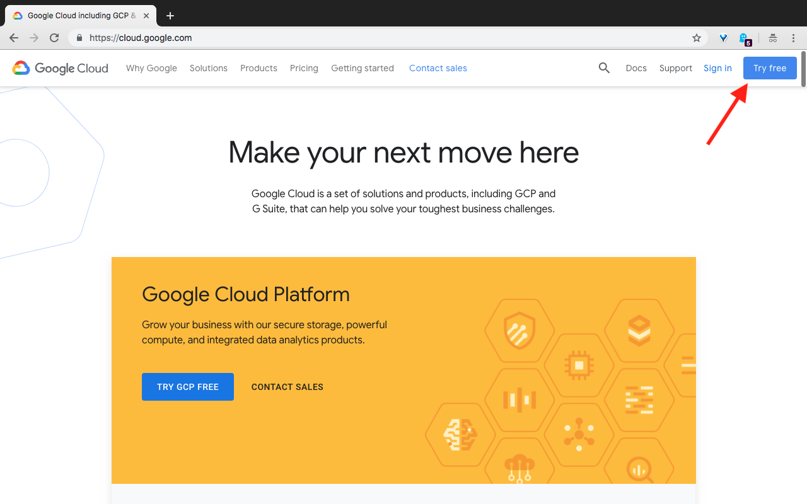
    <div><span>Fig. 1</span></div>
</div>

You will then be prompted to sign in using your Google account. Proceed to sign in using your desired Google account. Unless otherwise instructed use a gmail account that is different from your __kent.edu__ account.

### Step 2

Once you've signed in you should be taken to the _terms of service_ page for trying Google cloud platform for free. Proceed to choose your country (in this case keep the country as United States) and then click on the __AGREEE AND CONTINUE__ button.

<div align="center">
    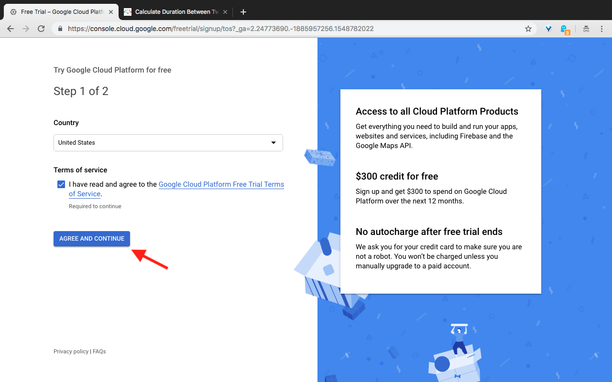
    <div><span>Fig. 2</span></div>
</div>

You will then have to create a payment profile which according to Google "A payments profile is shared and used across all Google products."

<div align="center">
    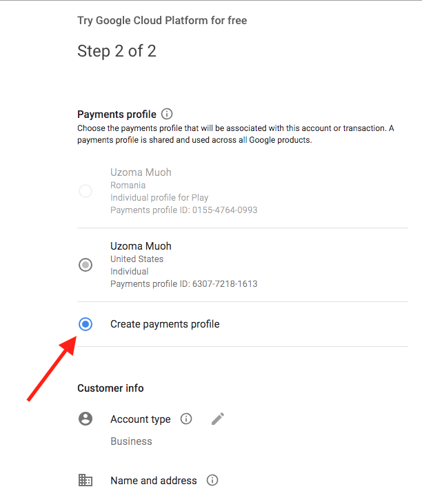
    <div><span>Fig. 3</span></div>
</div>

__NOTE__: Completing the payment profile requires a payment method to be provided so either credit or debit card. However you should not worry as upon completion of the sign up process for Google's cloud platform we will receive __$300__ dollars credit valid for __12__ months.

In addition to the __$300__ dollars credit, Google's cloud platform free their offers services that are always free (with some constraints of course). You can find more about their free tier by [clicking here](https://cloud.google.com/free/).

Once you have completed the form by filling out all the information proceed to clicking on the __START MY FREE TRIAL__ button

<div align="center">
    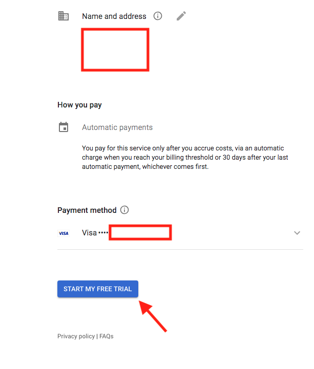
    <div><span>Fig. 4</span></div>
</div>

Once your payment profile and billing information has been all set up, you should see something similar to __Fig. 5__. Proceed and click on the __GOT IT__ button.

<div align="center">
    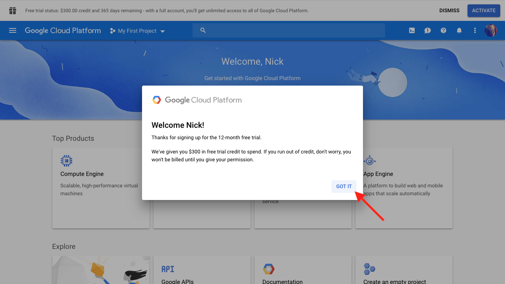
    <div><span>Fig. 5</span></div>
</div>

### Step 3

By default once your account has been set up correctly Google Cloud platform would have created a project for you called __My First Project__. Projects in Google cloud is an organizing tool aimed to help you put together resources such as virtual machines, databases, firewalls etc under the same unit.

>In the case you don't have a project already created for you, you can easily create a new one yourself by clicking on the __Select a project__ button then once a dialog window opens click on the __NEW PROJECT__ button to create your new project (Fig. 6). It is best to choose a project name that name that is easily recognizable and makes sense.

<div align="center">
    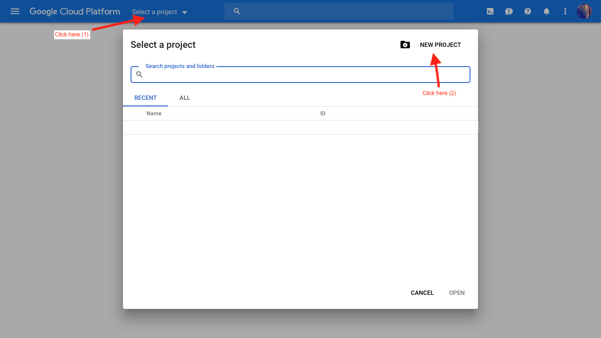
    <div><span>Fig. 6</span></div>
</div>

Assuming that you have a Google cloud project, we can proceed in creating a cloud virtual machine.

Begin by clicking on the hamburger menu at the top left corner, once that has been clicked a sidebar menu should appear (Fig. 7).

<div align="center">
    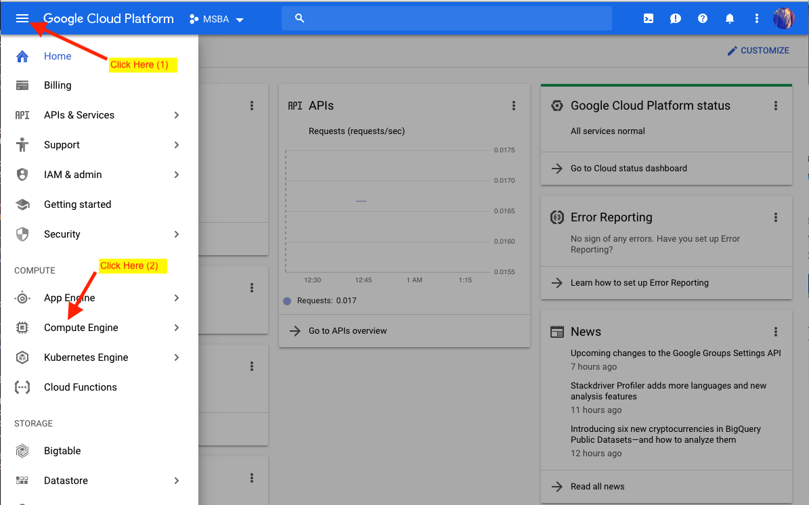
    <div><span>Fig. 7</span></div>
</div>

Click on the __Compute Engine__ sub menu option. Once you've chosen the option by clicking on it, you maybe asked too create a billing account.

Because we initially signed up for Google cloud account with $300 free credit, all we have to do is to click on the __Set up billing__ then when another window pops up asking which account to set up billing click on the __Set Account__ button.

You should see a page appear like in Fig. 8 when all has been done properly.

<div align="center">
    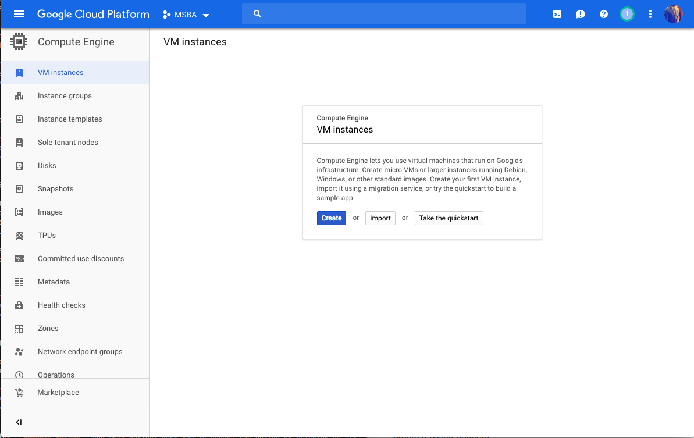
    <div><span>Fig. 8</span></div>
</div>

Proceed to click on the __Create__ button. You will then be taking to the __Create Instance__ page (Fig. 9), this is the page in which we will create our virtual machine.

<div align="center">
    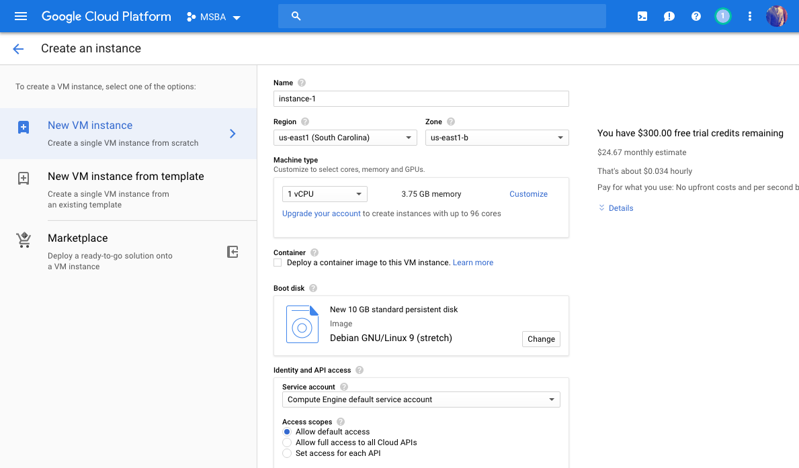
    <div><span>Fig. 8</span></div>
</div>

### Step 4

You can start out by giving a name to your virtual machine (In Google cloud they refer to virtual machines as instances, nonetheless they mean the same thing), I will name my virtual machine as __mis-64011__.

#### Step 4.1

The next step is to specify the __Region__ and __Zone__. For the __Region__ please select __us-east (South Carolina)__ this is the location that is closest to Ohio and the closer our virtual machine is to us the lesser the network latency.

As for the __Zone__ please choose __us-east1-b__.

#### Step 4.2

Next we need to choose our __Machine type__, proceed by clicking on the __Customize__ text (Fig. 9).

<div align="center">
    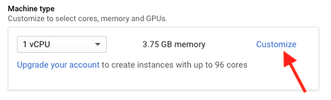
    <div><span>Fig. 9</span></div>
</div>

#### Step 4.3

Before we can proceed to choosing the number of CPUs and memory we want we need to upgrade our account so that our choice for CPUs and memory will not be constrainted. So please click on the __Upgrade your account__ link. You should see something similar to Fig.11 appear.

<div align="center">
    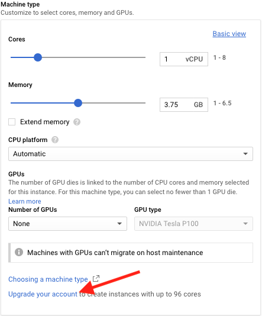
    <div><span>Fig. 10</span></div>
</div>

<div align="center">
    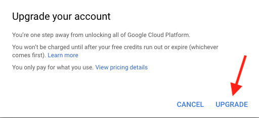
    <div><span>Fig. 11</span></div>
</div>

Once you have clicked on the __UPGRADE__ button, Google will ask you whether you want to refresh the page; proceed in clicking the __OK, REFRESH NOW__ button.

#### Step 4.4

Repeat __Step 4.2__ and make sure your Machine Type configuration looks like what is shown in Fig. 12

<div align="center">
    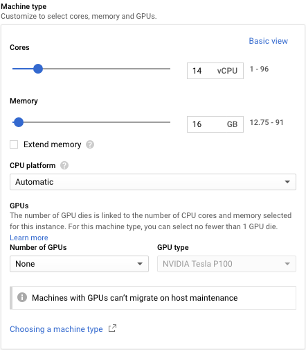
    <div><span>Fig. 12</span></div>
</div>

#### Step 4.5

The next thing we need to do is to set up the __Boot disk__. Proceed by clicking on the __Change__ button.

<div align="center">
    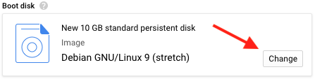
    <div><span>Fig. 13</span></div>
</div>

Once a side panel menu appears choose __Ubuntu 18.10__ then click the __Select__ button (Fig. 14)

<div align="center">
    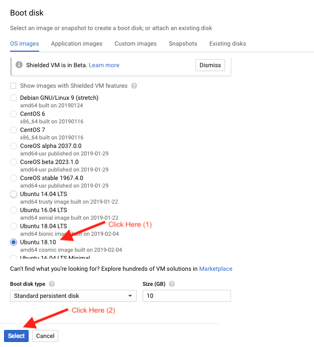
    <div><span>Fig. 14</span></div>
</div>

#### Step 4.6

Ensure that checkboxes for __Allow HTTP traffic__ and __Allow HTTPS traffic__ are checked.

<div align="center">
    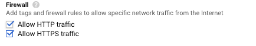
    <div><span>Fig. 15</span></div>
</div>

#### Step 4.7

Click on the __Management, security, disks, networking, sole tenancy__ (Fig. 16) link then click on the __Security__ tab (Fig. 17).

<div align="center">
    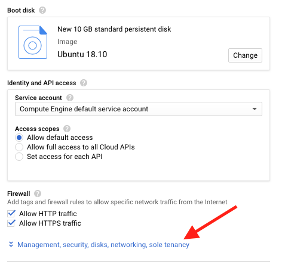
    <div><span>Fig. 16</span></div>
</div>

<div align="center">
    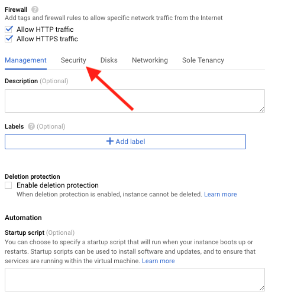
    <div><span>Fig. 17</span></div>
</div>

Copy all the text found within the below block into textarea that says _Enter entire key data_

```
ssh-rsa AAAAB3NzaC1yc2EAAAADAQABAAABAQCt0IlOHRdREDslBwAwj8jE5fYvDpE+GRmokrj1BLE3HD4Yh7mSRJoeTgXuqEg3tb/Lt/7GkhKzdHn120ivBi1BY6PPJTY7lR7TMe+OWNRlBVakxUSPZPQYn9JovSbs7QlNANcCyDoiQfzfc5GeZqzgjo8UDz0eaAKd/pG0RuPNQsQTPXEd4fkYlp2LBL4DTRsIAJnx9aSyMI6YY8Re1iTeezgpVqEOBXikncQdkiGTTrtOEW9DIBy1HUCY/edZTgiOR5VuLHk88LU2Iw8pGRhmjRWHCl8ODSMhXYdTnWiHq9OtPmf5o5f1e9LoT2W7QUArvsJhOZxNoxWEkuN+5NNL idao
```

<div align="center">
    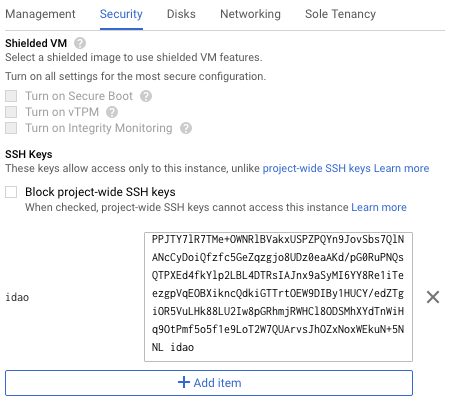
    <div><span>Fig. 18</span></div>
</div>

Lastly we click on the __Create__ button.

### Step 5

You should be taken to the page shown in Fig. 19. At this point your virtual machine (instance) is in the process of being created and once that has finished a green circular check mark should appear next to the name of your virtual machine.

<div align="center">
    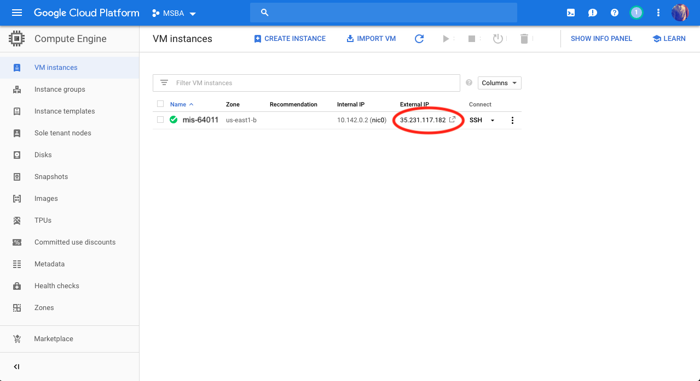
    <div><span>Fig. 19</span></div>
</div>

> Note: Please pay attention to the __External IP__ because it will be used to finish the rest of the setup. So it is advised that you keep it handy by memorizing it or writting it somewhere that is secure.

### Step 6

While on the page show in Fig. 19 and your VM instance is running, please click on
the __SSH__ button under the column Connect (Fig. 20).

<div align="center">
    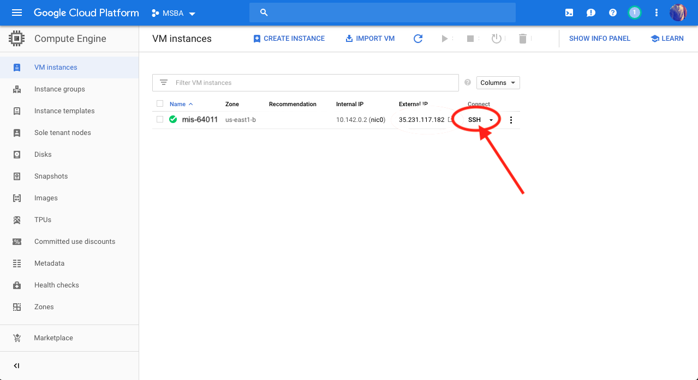
    <div><span>Fig. 20</span></div>
</div>

A new tab on your browser will open and Google cloud will begin creating an SSH connection to your server and then open a terminal window to it.

<div align="center">
    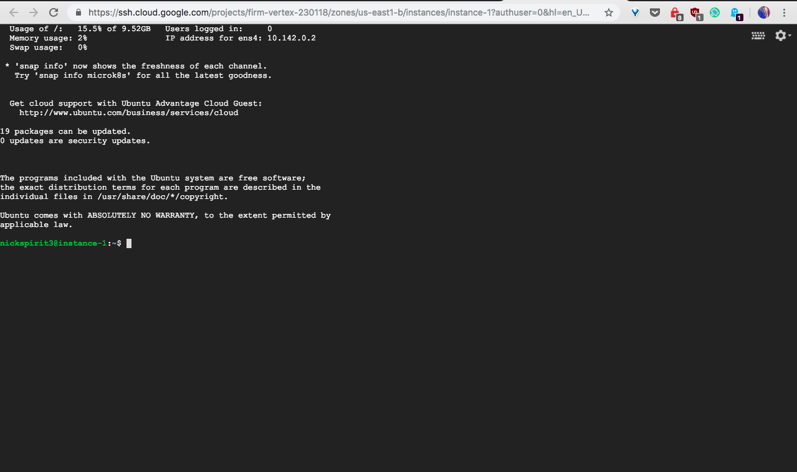
    <div><span>Fig. 21</span></div>
</div>

Copy the below code and past it to the terminal window

```bash
curl https://gist.githubusercontent.com/OdinTech3/d227eca7aa2439fa38cada0b7ec9c0e8/raw/0890810a3fa78cac4eb1cf27f944b656eb5da168/manage-user.sh | sudo bash -s <username> <password>
```

__IT IS IMPORTANT YOU REPLACE THE PLACEHOLDERS `<username>` and `<password>` WITH YOUR OWN USERNAME AND PASSWORD__

Once you have pasted the code then you press the __Enter__ key on your keyboard. You should see an out put similar to this:

```
  % Total    % Received % Xferd  Average Speed   Time    Time     Time  Current
                                 Dload  Upload   Total   Spent    Left  Speed
100  1706  100  1706    0     0  10596      0 --:--:-- --:--:-- --:--:-- 10596
[BASH]  Creating custom group idao .....
[BASH]  Creating custom user user_nick .....
[BASH]  The accounts are setup.
```

You may close the terminal window by closing the browser tab.

<div align="center">
    <div><h2>🎉 Congratualations! You have created your first Google Cloud virtual machine 🎉</h2></div>
</div>

